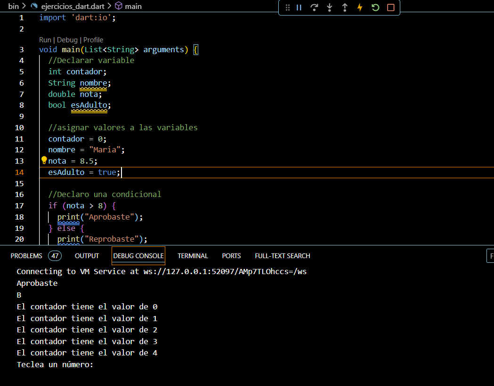
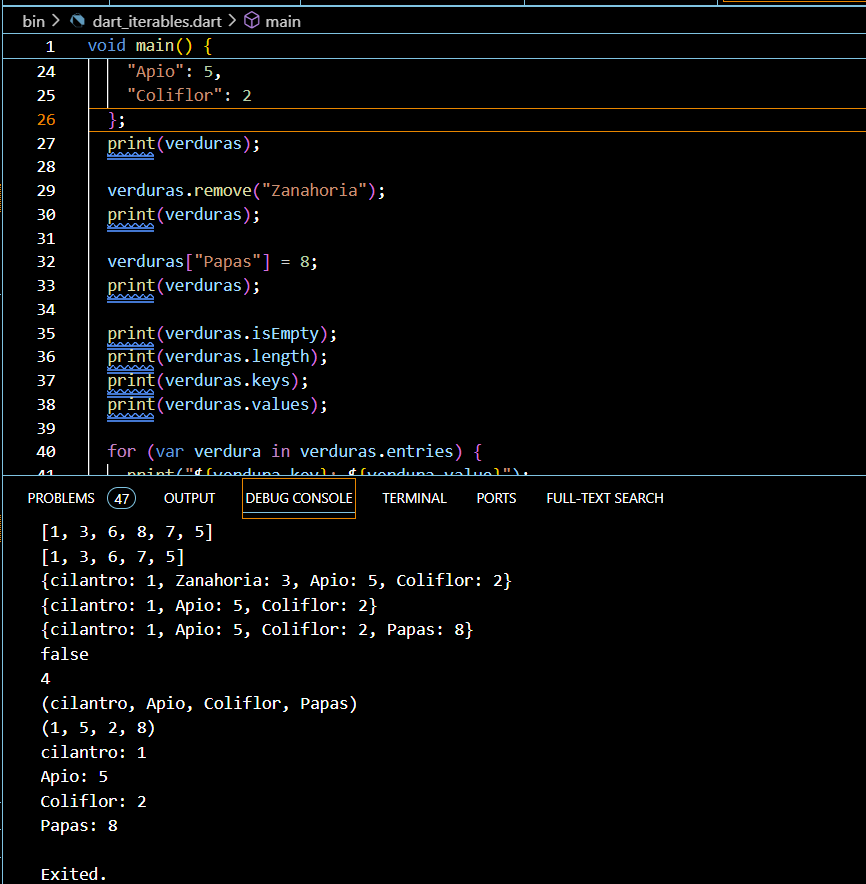
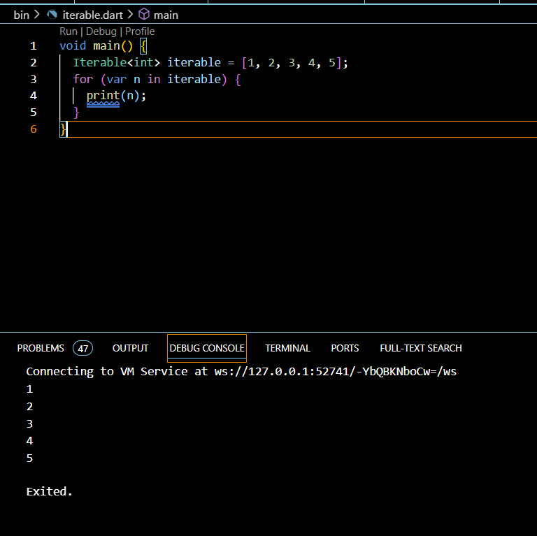
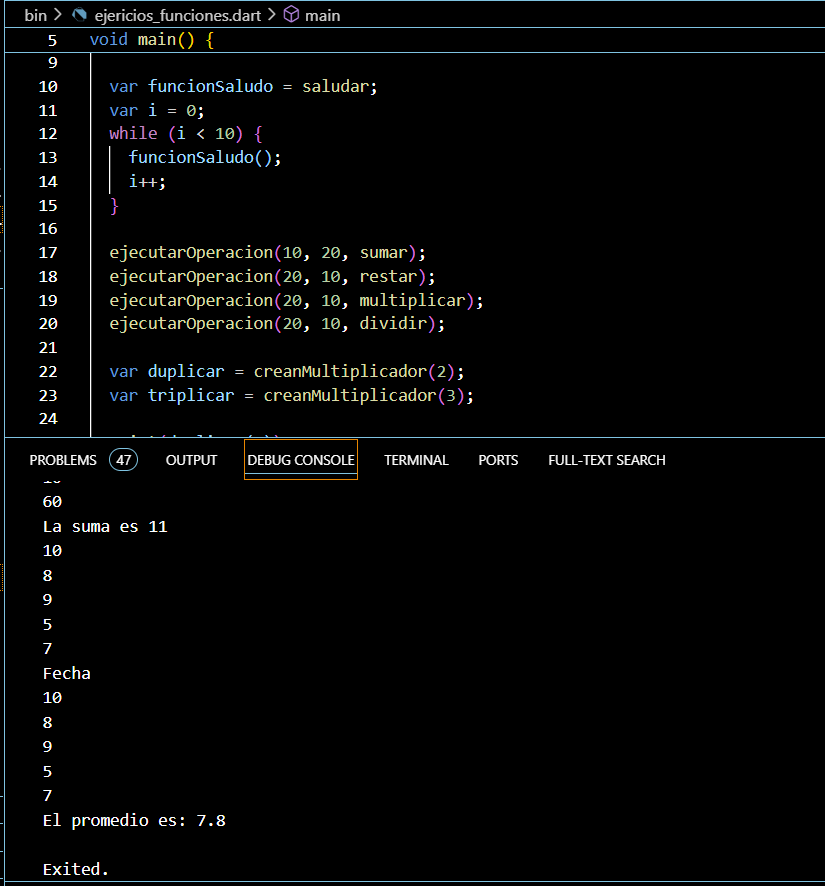

## Nombre de Alumno: Ana Isabel Jasso Velázquez

## Grupo: GIDS4093

## Ejercicios y Capturas

Ejercicio 01: Hello World 1

Ejercicio 02-08: Ejericios dart (

    02 Variables
    

    03 Maps
    

    04 List, maps and interables
    
    

    05 Functions
    
    06 Classes
    07 Constructors and names
    08 Get and Set
) 

Ejercicio 09 abstract_class

Ejercicio 10 mixins

Ejercicio 11 futures

Ejercicio 12-13 try_catch (Async await y try catch finally)

Ejercicio 14-15: streams (Streams y Streams await)

16 Aplicación Helloworld 

17 Aplicación YesOrNo: yes_no_app

18 Arquitectura Limpia: ddi_phone

